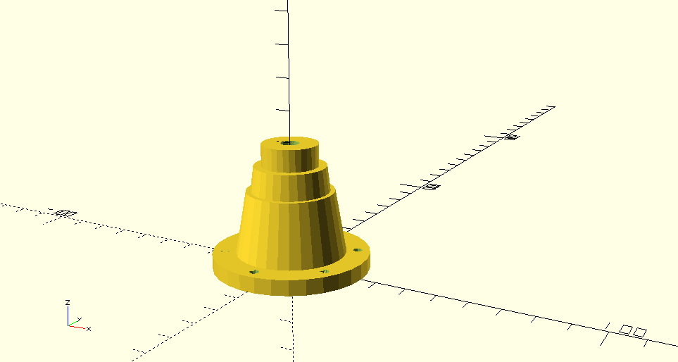

# Ghostbusters

Ghostbusters cosplay parts and electronics.

OpenSCAD models for various parts for the Ghostbusters uniform, proton pack (GB1/2) and various accoutrements.

In the `venkman` folder are some Arduino sketches and designs for lighting and sounds (in progress).

## Useful links

- This is a great Thingiverse project that has many of the parts I used in my proton pack: <https://www.thingiverse.com/thing:95635>

## Credits

- Knurled knobs use aubenc's library - http://www.thingiverse.com/thing:31122
